## Информационные технологии: лабораторная работа №3 (Docker)

### Выполнил: студент группы ИС-23 Долгополов Максим

---

### Задание 1.

Ссылка на репозиторий: https://hub.docker.com/repository/docker/max0194/custom-nginx/general .

### Задание 2.

Выполненные команды:

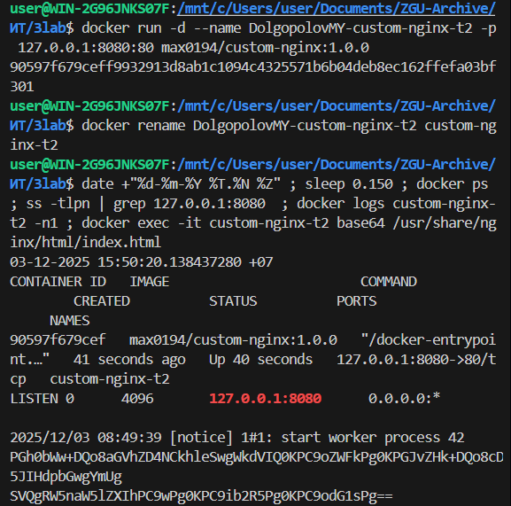

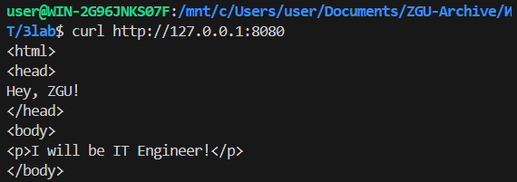

### Задание 3.

Выполненные команды:
Через docker attach подключаемся к потоку ввода/вывода/ошибок контейнера.

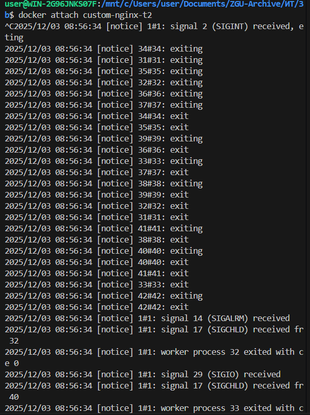

Комбинация Ctrl+C отправляет сигнал потоку attach об прекращении отслеживания.

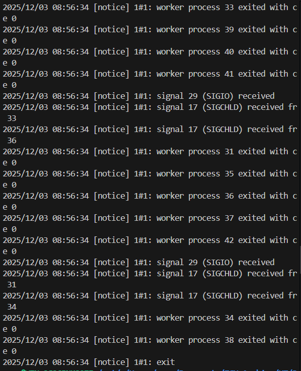

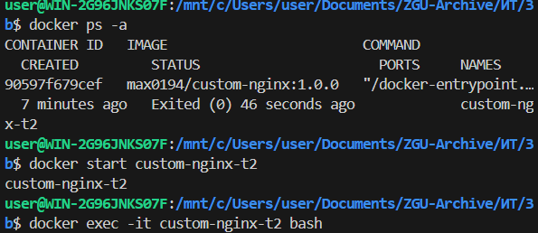

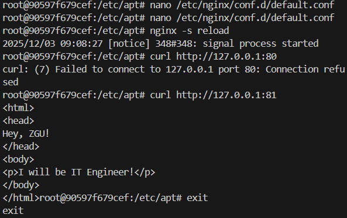

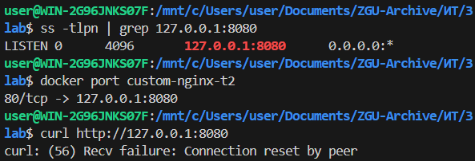

Поскольку мы изменили прослушиваемые порты (listen) с 80 на 81, по итогу nginx в контейнере прослушивает только 81 порт.

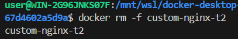

Удалить запущенный контейнер одной командой можно при помощи команды docker rm -f custom-nginx-t2 (параметр -f - force).

### Задание 4.

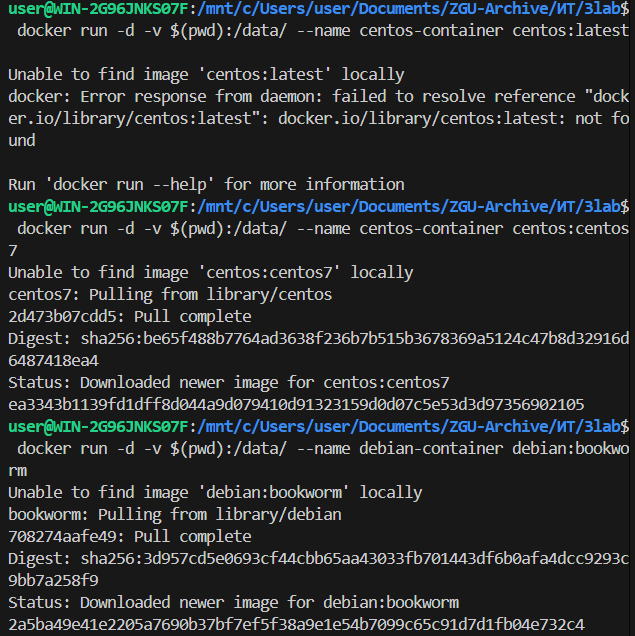

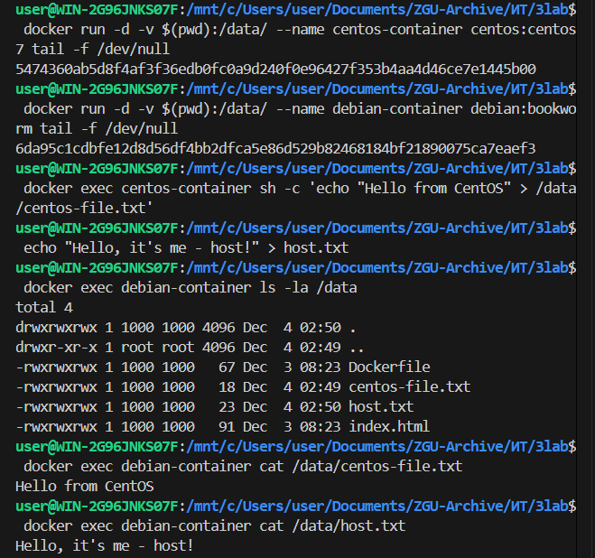

### Задание 5.

Были созданы compose.yaml

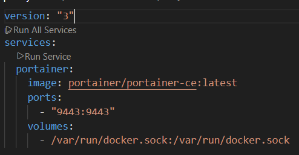

И docker-compose.yaml

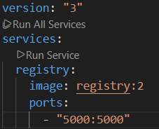

Запуск docker compose up -d:

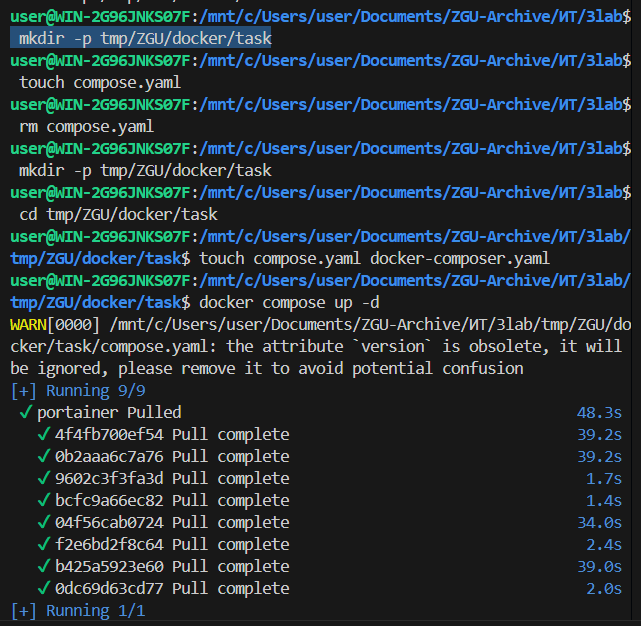

При запуске команды docker compose up -d docker-compose-plugin изначально ищет файлы с именем compose формата .yaml или .yml. Если он не находит, то ищет docker-compose.yaml (или .yml).

Чтобы происходил запуск двух и более .yml и .yaml нужно указать через include название второго compose-файла:

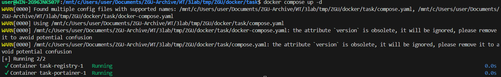

Далее пушим изменения:

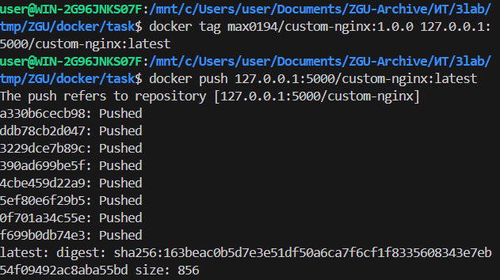

После заходим на страницу portainer (localhost:9432) и по пути /home/local/stacks и add stack добавляем компоуз. Затем уже по пути /docker/containers/123-custom-nginx/inspect мы видим следующее:

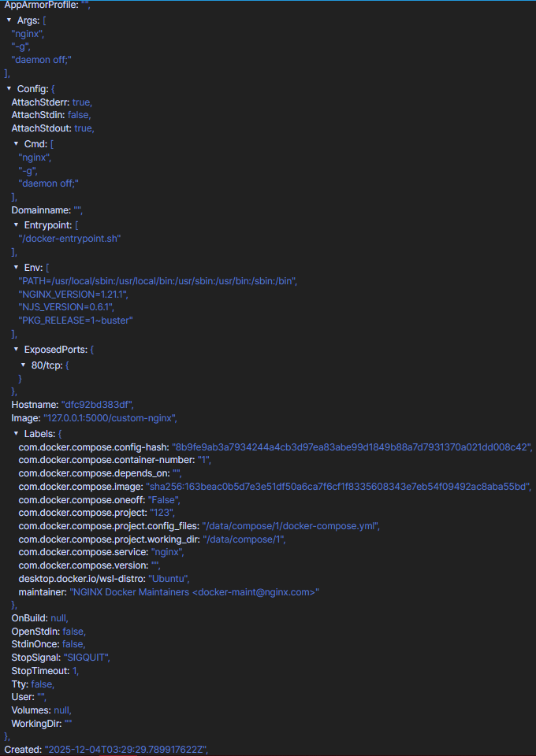

При удалении compose.yaml видим:

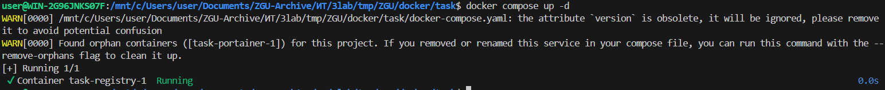

Вторая WARN здесь указывает на то, что созданный в уже удаленном compose.yaml контейнер task-portainer-1 стал "сиротой", иначе - в текущем состоянии он может быть не нужен, так как не указан в имеющемся docker-compose. Далее предлагается при помощи флага --remove-orphans (удалить "сирот"), т.е. запустить команду docker compose up -d --remove-orphans и контейнер-сирота task-portainer-1 удалится.

