## Информационные технологии: лабораторная работа №3 (Docker)

### Выполнил: студент группы ИС-23 Долгополов Максим

---

### Предисловие

Для выполнения лабораторной работы была выбрана среда в виде подсистемы Ubuntu для Windows (WSL2). Сам Docker был установлен вместе с приложением Docker Desktop, а Docker Compose командой apt-get install docker-compose-plugin.

---

### Задание 1. Сборка нового образа.

Для отправки новой страницы index.html в nginx нужно создать HTML-документ, например:

<details>
<summary><strong>Спойлер</strong></summary>

```html
<html>
<head>
Hey, ZGU!
</head>
<body>
<p>I will be IT Engineer!</p>
</body>
</html>

```

</details>

Далее создаем Dockerfile с инструкцией к сборке нового образа, при этом инструкция FROM означает исходный образ для сборки, а COPY позволяет копировать файл из директории машины в директорию исходного образа:

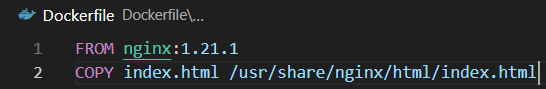

При помощи команды ```docker build``` создаем образ с именем max0194/custom-nginx и тегом 1.0.0:

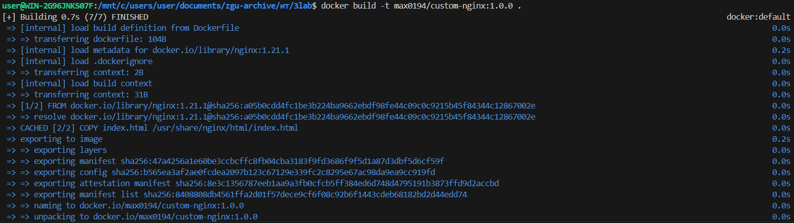

При помощи ```docker push``` отправляем на удаленный репозиторий созданный образ:

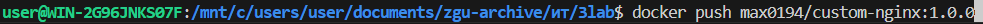

В репозитории видим результат:

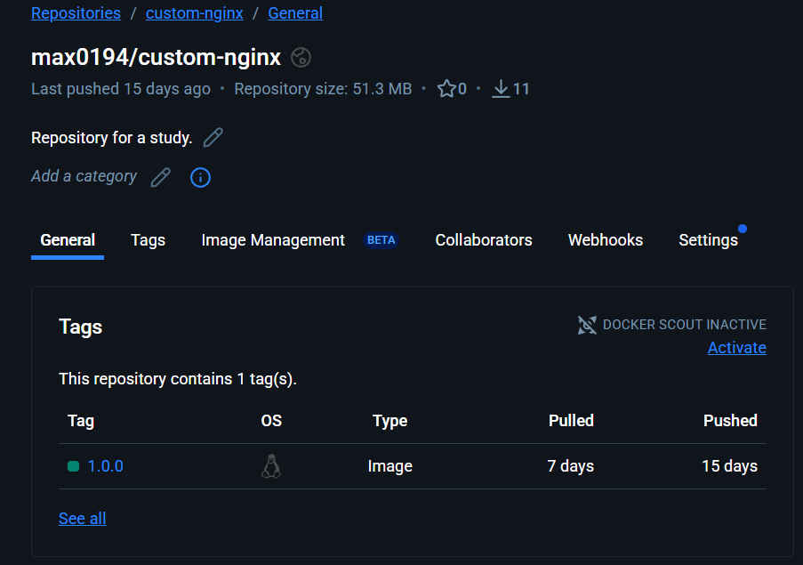

Ссылка на репозиторий: [репозиторий](https://hub.docker.com/repository/docker/max0194/custom-nginx/general) .

---

### Задание 2. Запуск контейнера.

При помощи ```docker run``` запускаем контейнер с ФИО в названии (флаг --name) в фоне (флаг -d) с настройками сети 127.0.0.1:8080:80 (флаг -p) из существующего образа (max0194/custom-nginx:1.0.0):

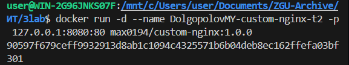

Чтобы переименовать запущенный контейнер нужна команда ```docker rename```:

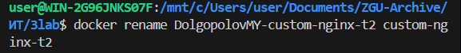

Команда ниже состоит множества других команд. Она выводит:
1. Время в заданом формате (date);
2. Задает таймер для запуска следующей команды (sleep);
3. Выводит список активных контейнеров (docker ps);
4. Выводит список сетевых соединений с флагом -tlsp (tcp + listen + summary + ports) и только с IP 127.0.0.1 и портами 8080 (grep);
5. Выводит логи для контейнера custom-nginx-t2;
6. В конце  интерактивно преобразует index.html в nginx в формат base64 (docker exec -it).

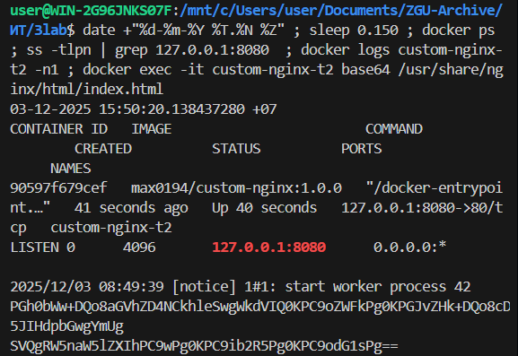

При помощи curl проверяем, работает ли указанное в контейнере соединение и изменился ли index.html в nginx:


---

### Задание 3. Работа с потоками ввода и вывода контейнера.

Через docker attach подключаемся к потоку ввода/вывода/ошибок контейнера. Нажимаем комбинацию CTRL+C:


Через ```docker ps -a``` просматриваем все контейнеры (в т.ч. остановленные):

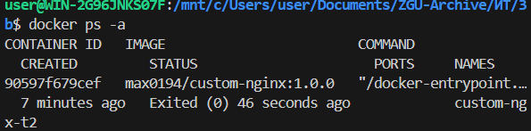

Комбинация Ctrl+C отправляет сигнал потоку attach об прекращении отслеживания (SIGINT).

Запускаем контейнер и переходим в интерактивный терминал custom-nginx-t2 с оболочкой bash:

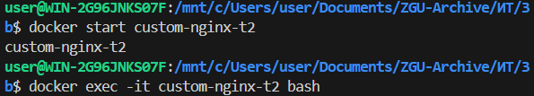

Через встроенный редактор nano меняем порт в файле default.conf с 80 на 81 и пробуем здесь же открыть через curl index.html:


Изменения применены. Выходим из терминала контейнера и пробуем открыть страницу index.html в контейнере через внешний порт:


И поскольку мы изменили прослушиваемые порты (listen) с 80 на 81, по итогу nginx в контейнере прослушивает только 81 порт и происходит ошибка. Исправить можно либо возвращением порта 80 в файле default.conf, либо пересоздаением контейнера.

Удалить запущенный контейнер одной командой можно при помощи команды docker rm -f custom-nginx-t2 (параметр -f - force).


---

### Задание 4. Запуск контейнеров с заданными директориями.

Для начала скачиваем образы из registry командой ```docker pull```. Затем, при помощи команды ```docker run -d -v $(pwd):/data``` подключаем текущую директорию к директории data в контейнерах, а также указываем в конце интересную строку - ```tail -f /dev/null``` - чтобы контейнер прослушивал несуществующий файл и работал постоянно в фоне:

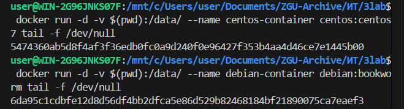

Командой ```docker exec``` выполняем команды внутри контейнера - echo и ls - для отправки текста в host.txt и centos-file.txt, а также просмотра списка файлов в контейнерах.

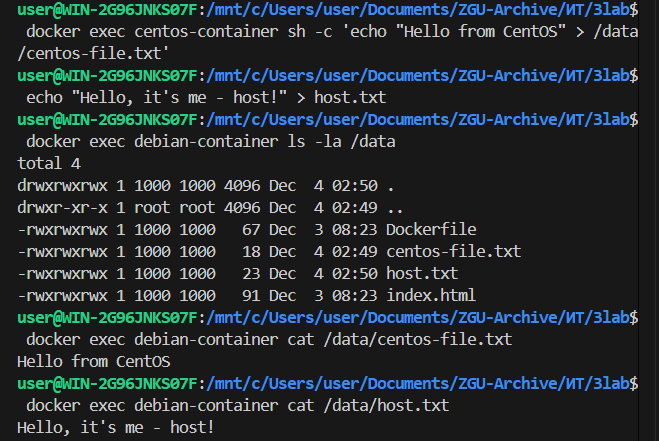

---

### Задание 5. Работа с Docker Compose.

Были созданы compose.yaml


И docker-compose.yaml


Запуск docker compose up -d:


При запуске команды docker compose up -d docker-compose-plugin изначально ищет файлы с именем compose формата .yaml или .yml. Если он не находит, то ищет docker-compose.yaml (или .yml).

Запустить два и более .yml и .yaml можно двумя способами:
1. Через флаг ```-f``` можно указать названия compose файлов вручную, например: ```docker compose up -d -f compose1.yaml compose2.yaml```, при этом объединение сервисов будет происходить в том порядке, в котором указаны файлы.
2. Можно указать через include название второго compose-файла в основном compose.yaml (или docker-compose.yaml):

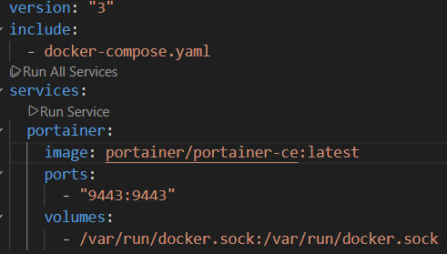


Далее пушим изменения:


После заходим на страницу portainer (localhost:9432) и по пути /home/local/stacks и add stack добавляем компоуз. Затем уже по пути /docker/containers/123-custom-nginx/inspect мы видим следующее:


При удалении compose.yaml видим:


Вторая WARN здесь указывает на то, что созданный в уже удаленном compose.yaml контейнер task-portainer-1 стал "сиротой", иначе - в текущем состоянии он может быть не нужен, так как не указан в имеющемся docker-compose. Далее предлагается при помощи флага --remove-orphans (удалить "сирот"), т.е. запустить команду docker compose up -d --remove-orphans и контейнер-сирота task-portainer-1 удалится.

---

### Заключение

В ходе выполнения заданий я научился:

- Создавать и настраивать Docker-образы (Dockerfile, docker build, docker push).

- Работать с контейнерами: запускать, останавливать, переименовывать, подключаться к ним и проверять их логи (docker run, docker exec, docker attach).

- Управлять сетевыми настройками контейнеров, пробрасывая порты (-p 127.0.0.1:8080:80).

- Монтировать файловые системы хоста в контейнер с помощью томов (-v $(pwd):/data).

- Организовывать и запускать многоконтейнерные приложения с помощью Docker Compose (docker compose up -d), а также управлять стеками через Portainer.

- Понимать последствия изменения конфигурации внутри контейнера (например, смены порта Nginx) и способы их устранения.

Docker предоставляет гибкий инструментарий для изолированной упаковки и развертывания приложений, в свою очередь Docker Compose значительно упрощает оркестрацию нескольких сервисов.

