# **Введение** #

Данная лабораторная работа направлена на настройки и интеграции между GitLab и Nexus, реализации автоматического пайплайна CI/CD для Python-приложения, включающего запуск тестов, сборку Docker-образа и его публикацию в репозиторий Nexus.

Работу выполнил студент ИС-23:

- Макаров Д.Е


## Подготовка окружения (GitLab + Nexus) ##
Для начала необходимо поднять сервисы **GitLab** и **Nexus** с помощью **Docker Compose**.
Создаём папку **lab4** командой
```
mkdir ~/lab4
```
и переходим в неё командой cd. Далее создаем файл docker-compose командой
```
docker-compose.yaml
```
Заполняем его содержимым:

<p align="center">
  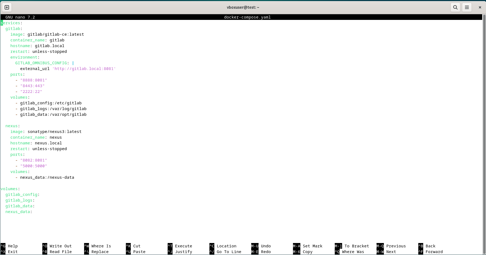
</p>


Далее загружаем и запускаем контейнеры командой
```
docker compose up -d
```
После запуска контейнеров проверим их статус командой
```
docker ps -a
```

<p align="center">
  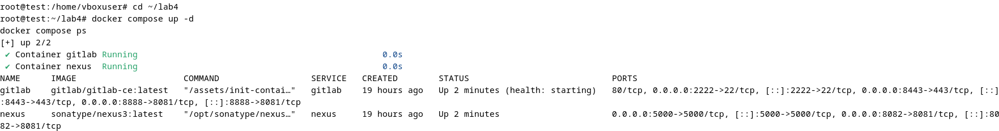
</p>

В файл **/etc/hosts** внесем записи **gitlab.local** и **nexus.local**. Это нужно для того, чтобы операционная система знала, как преобразовать эти доменные имена в IP-адреса, потому что это не реальные домены в интернете, а локальные имена для наших контейнеров.

<p align="center">
  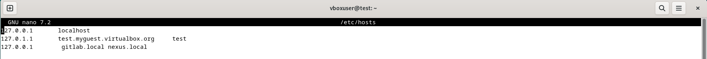
</p>

После запуска проверяем доступность сервисов:
- GitLab: http://gitlab.local:8888

- Nexus: http://nexus.local:8082


После запуска контейнера **GitLab** пароль генерируется автоматически и хранится внутри контейнера. Пароль администратора Nexus также хранится в файле внутри контейнера. Чтобы их получить нам нужно выполнить несколько команд. Для **Gitlab**:
```
docker exec gitlab grep 'Password: ' /etc/gitlab/initial_root_password
```

<p align="center">
  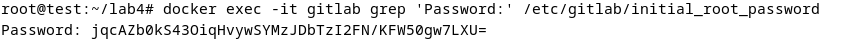
</p>

Для nexus:
```
docker exec nexus cat /nexus-data/admin.password
```

<p align="center">
  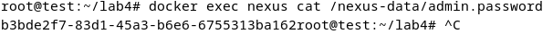
</p>

Далее нам нужно зайти в **Gitlab** под именем **root** с помощью полученного пароля. По итогу видим начальную страницу:

<p align="center">
  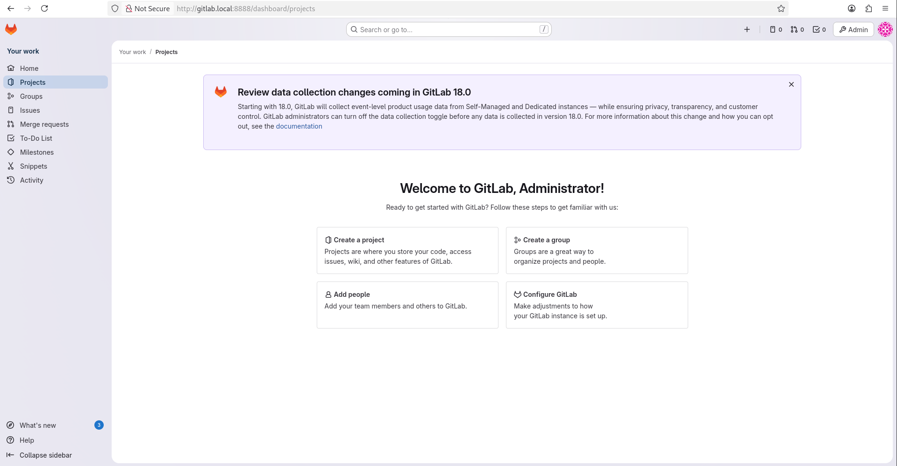
</p>

Для **Nexus** проделываем все то же самое, но под именем **admin**. Важно знать, что пароль, полученный из контейнера, будет стерт сразу после первого входа. По итогу так же видим главную страницу:

<p align="center">
  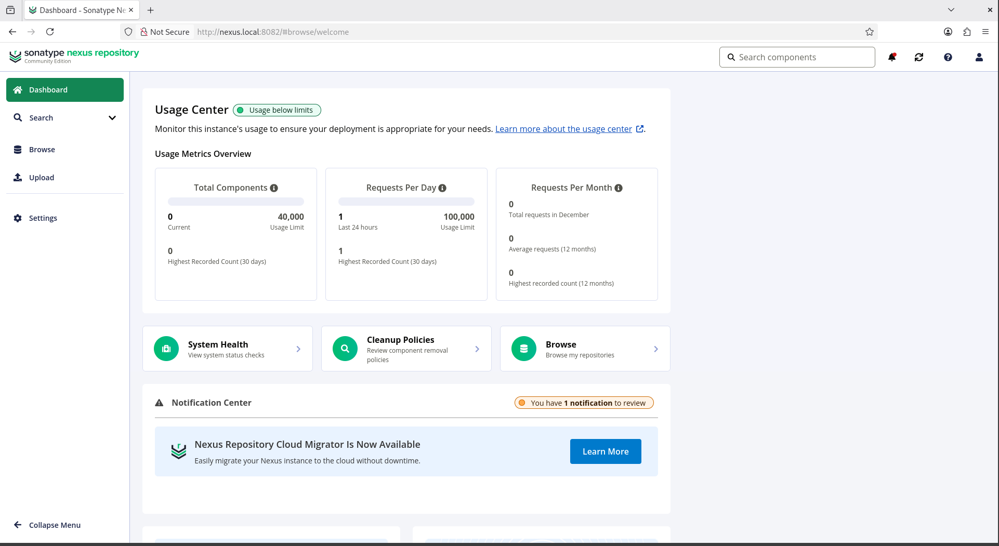
</p>


## Создание Docker-репозитория в Nexus ##
Для хранения собранных Docker-образов в **Nexus** необходимо создать специальный репозиторий типа Docker (hosted). Для этого переходим в раздел репозиториев. На открывшейся странице видим список существующих репозиториев:

<p align="center">
  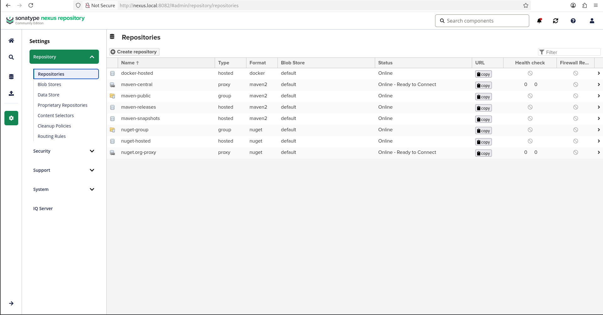
</p>

Нажимаем кнопку **Create repository** в верхней части страницы. Формат нашего репозитория - docker с типом hosted для хранения собственных образов. Далее заполняем форму:
- **Name:** docker-hosted (можно любое)
- **HTTP:** ставим галочку и указываем порт 5000 (Это порт Docker Registry API)
- **Allow anonymous docker pull:** для CI/CD обычно разрешаем, чтобы не логиниться каждый раз.
- **Strict Content Type Validation:** гарантирует, что в Docker-репозиторий загружаются только Docker-образы. Предотвращает случайную загрузку файлов неправильного типа и повышает безопасность.
- **Deployment policy:** allow redeploy - разрешить переразвёртывание для перезаписи существующих артефактов


<p align="center">
  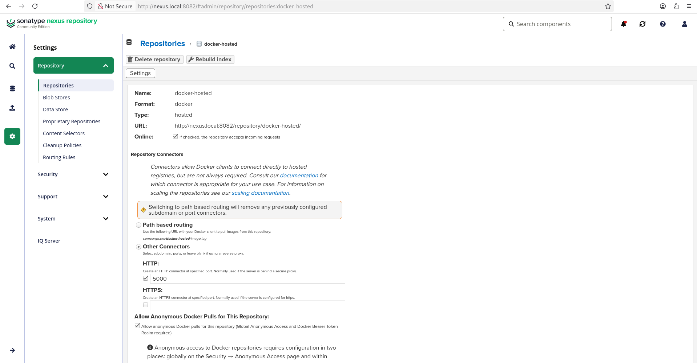
</p>

<p align="center">
  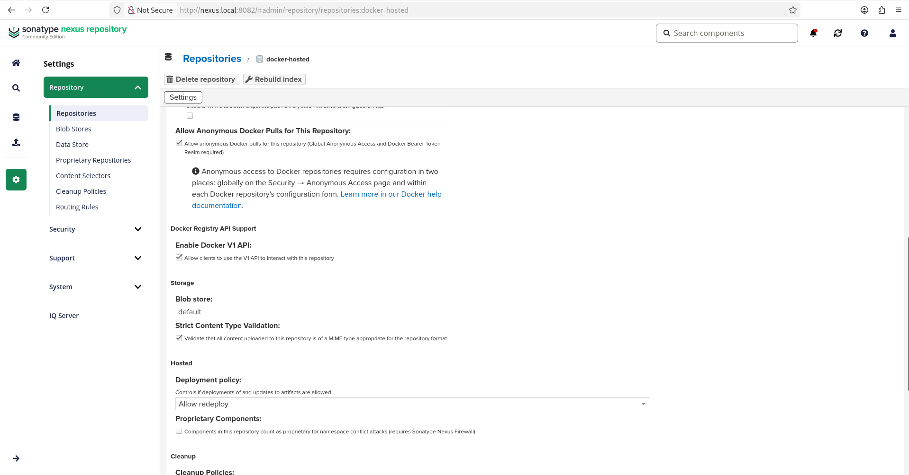
</p>

## Проверка работоспособности Docker Registry в Nexus ##
Для проверки доступности и функциональности Docker Registry был выполнен HTTP-запрос к API реестра с использованием утилиты **curl**:
```
curl -I http://nexus.local:5000/v2/
```
Опция **-I** была использована для получения только заголовков HTTP-ответа, чтобы оценить работоспособность сервиса без загрузки полного содержимого.

<p align="center">
  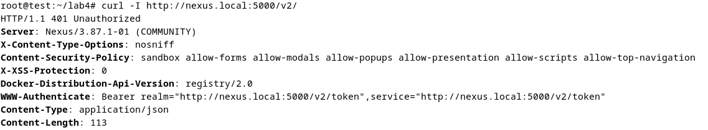
</p>

**HTTP/1.1 401 Unauthorized** — код состояния HTTP 401 свидетельствует о том, что запрос требует аутентификации пользователя.

## Настройка Docker для работы с репозиторием ##
Так как используется HTTP, нужно добавить **Nexus** в список insecure-регистров. Для этого редактируем конфигурацию Docker:
```
sudo nano /etc/docker/daemon.json
```
добавляем содержимое:
```
{
  "insecure-registries": ["nexus.local:5000"]
}
```
и перезапускаем docker:
```
sudo systemctl restart docker
```
## Создание и настройка GitLab Runner для выполнения пайплайнов ##
GitLab Runner — это отдельная программа, которая выполняет задания (jobs) из **.gitlab-ci.yml**. Без раннера пайплайны не будут запускаться. GitLab только управляет заданиями, а Runner их выполняет.

### Создание Runner в GitLab ###
Создадим раннер в веб-интерфейсе гитлаба через кнопку "Create instance runner". Instance runner — это раннер, доступный для всех проектов на всём экземпляре GitLab. В отличие от специфичных раннеров, инстанс раннеры могут использоваться любыми проектами. Заполняем форму:
- **Description:** вводим имя lab4-docker-runner
- **Tags:** оставляем пустым по желанию
- **Run untagged jobs:** включаем, раннер будет пытаться выполнять все задания, даже не помеченные тегами
- **Maximum job timeout:** оставляем 60 минут
- **Token expiry:** оставляем "Never expires"

<p align="center">
  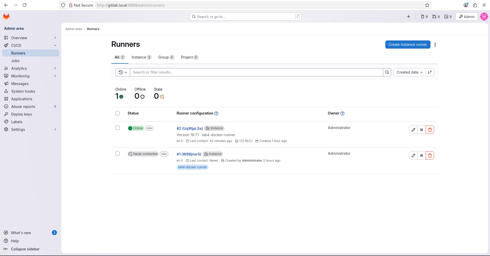
</p>

<p align="center">
  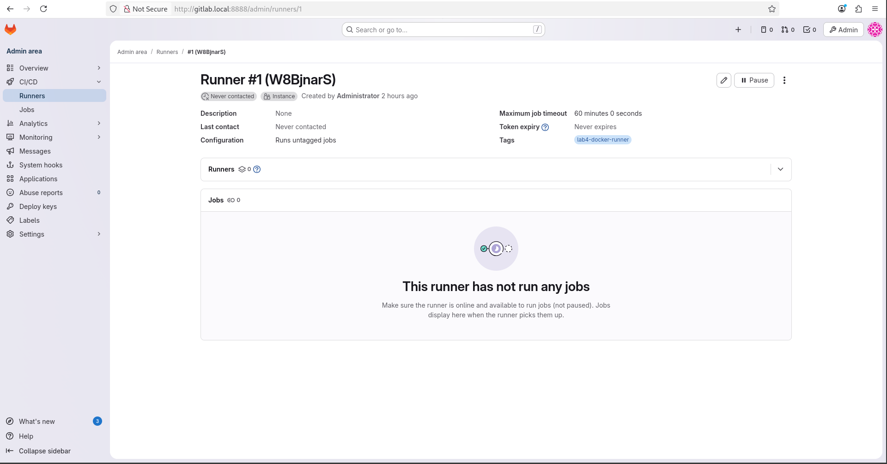
</p>

### Устанавливаем GitLab Runner на машину ### 
Скачиваем бинарник командой
```
curl -L "https://packages.gitlab.com/install/repositories/runner/gitlab-runner/script.deb.sh" | sudo bash
```
Далее устанавливаем раннер:
```
sudo apt-get install gitlab-runner
```
Убедимся в успешности установки и проверим версию командой
```
gitlab-runner --version
```

<p align="center">
  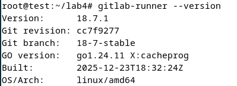
</p>

Далее нам нужно зарегестрирвоать раннер. Делаем это с помощью команды
```
sudo gitlab-runner register
```
Появится диалог, в котором мы отвечаем:
- **Enter the GitLab instance URL:** http://gitlab.local:8888/
- **Enter the registration token:** копируем токен из настроек проекта (рядом с кнопкой "Create instance runner")
- **Enter a description for the runner:** lab4-docker-runner
- **Enter tags for the runner (comma separated):** оставляем пустым
- **Enter optional maintenance note for the runner:** оставляем пустым
- **Enter an executor:** docker
- **Enter default Docker image:** docker:24.0

<p align="center">
  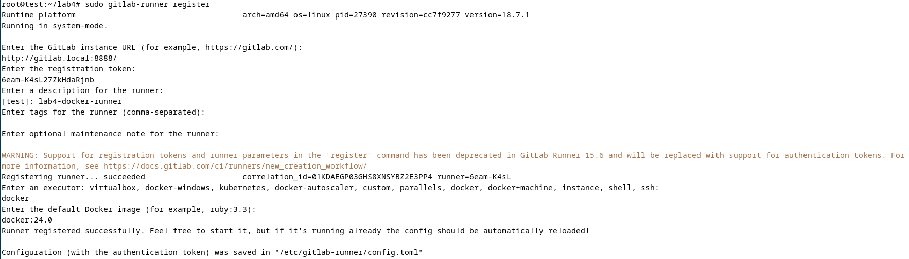
</p>

Далее проверяем успешность регистрации с помощью просмотра списка раннеров. Выполняем команду
```
sudo gitlab-runner list
```

<p align="center">
  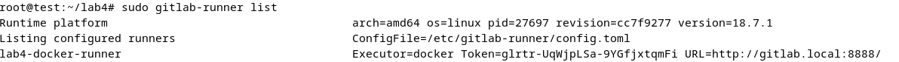
</p>

Конфигурация раннера:

<p align="center">
  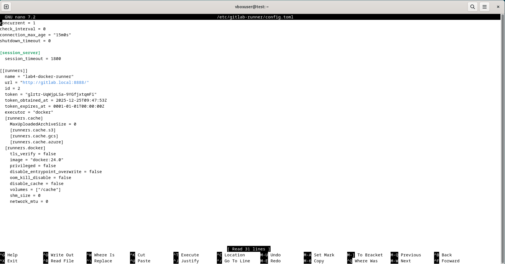
</p>

Runner использует образ **docker:24.0** и монтирует **docker:24.0-dind**, что позволяет:

- Запускать Docker команды внутри CI/CD пайплайна

- Собирать Docker образы

- Работать с Docker Registry

## Создание файлов Python-приложения и настройка CI/CD Variables в GitLab ##
### Создание файлов Python-приложения ###
Создадим структуру проекта. Для этого сделаем и перейдем в новую папку **python-app** командами
```
mkdir python-app
cd python-app
```
Добавим следующие файлы:
- text_tool.py - основное приложение, содержащее две функции для подсчета количества слов и нахождения самого длинного слова в тексте.
- test_text_tool.py - модульные тесты
- requirements.txt - зависимости Python
- Dockerfile - конфигурация Docker-образа
- .gitlab-ci.yml - конфигурация CI/CD пайплайна

<p align="center">
  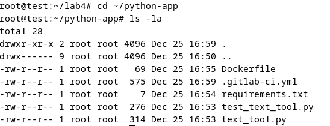
</p>

В докер-файле укажем следующие содержимое:
```
FROM python:3.10
WORKDIR /app
COPY text_tool.py /app/
CMD ["python"]
```
В файле .gitlab-ci.yml распишем наш пайплайн. Основные его части:
- **stages:** определяет этапы пайплайна (сначала тесты, потом сборка)
- **variables:** глобальные переменные для всего пайплайна
- **test job:** запускает тесты в контейнере Python 3.10
- **build_and_push job:**
  - Использует Docker-in-Docker для сборки образов
  - Логинится в Nexus
  - Собирает Docker-образ с тегом = короткий хеш коммита
  - Пушит образ в Nexus
- **only: main:** запускается только для ветки main

<p align="center">
  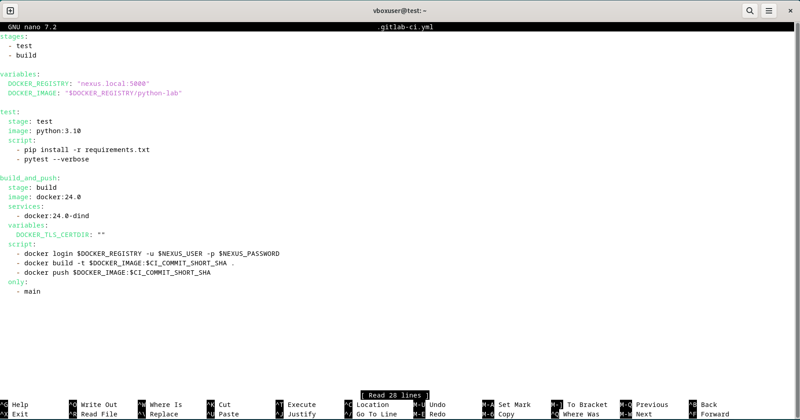
</p>

### Создание CI/CD Variables в GitLab ###
Переменные хранят чувствительную информацию (логины, пароли, токены), которую нельзя хранить в коде. Они передаются в окружение **jobs**. Из-за особенностей CI/CD Variables был создан новый пользователь в Nexus, которому были выданны права админа

Создаём переменную NEXUS_USER:
- **Key:** NEXUS_USER
- **Value:** LightBear (так как CI/CD Variables не позволяет вводить значения меньше 8 символов)

Создаём переменную NEXUS_PASSWORD:
- **Key:** NEXUS_PASSWORD
- **Value:** пароль из nexus сделанный для пользователя

Параметр **Protect variable** отвечает за доступность только для защищённых веток (main/master)
, а **Mask variable**  скрывает значение в логах

<p align="center">
  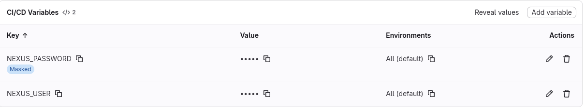
</p>

### Работа с репозиторием ###
После создания переменных нужно запушить данные в **GitLab**, чтобы запустился **CI/CD** пайплайн. Создаем публичный репозиторий на гитлабе с помощью кнопки New Project. Далее локально переходим в директорию проекта командой
```
cd ~/python-app
```
Инициализируем локальный Git репозиторий с помощью
```
git init
```
Связываем удаленный и локальный репозитории
```
git remote add origin http://gitlab.local:8888/root/python-lab-app.git
```
Добавляем все файлы в staging area:
```
git add .
```
Делаем первый коммит
```
git commit -m "Update gitlab-ci.yml"
```
Пушим в ветку main
```
git push -u origin main
```

## Запуск пайплайна ##
После пуша в ветку **main**, у нас автоматически отображается созданный **Pipelines**, в котором запускается сначала **Job** под именем "test".

<p align="center">
  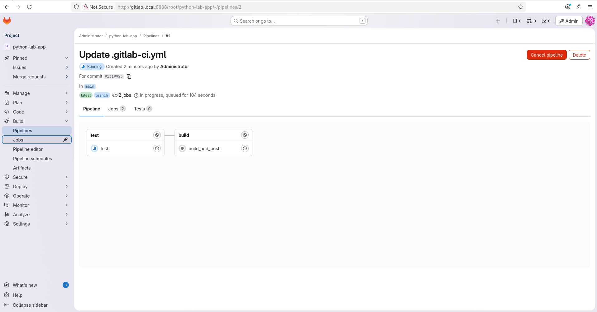
</p>

<p align="center">
  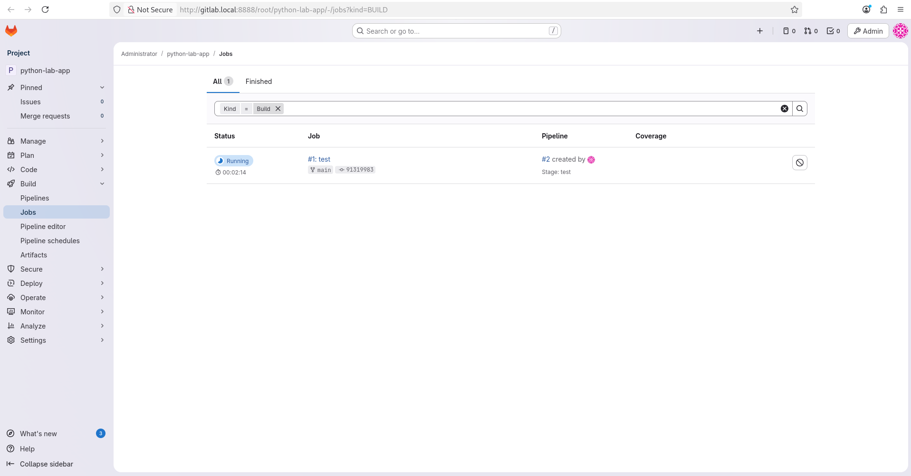
</p>

Test у нас успешно выполняет все заданные задачи и выводит в конце уведомление **Job succeede**.

<p align="center">
  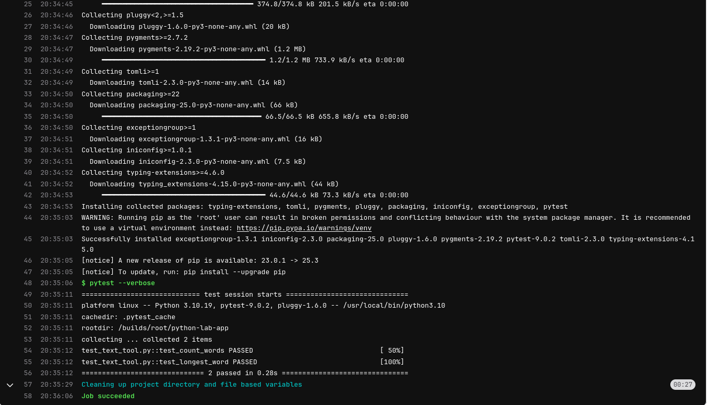
</p>

Далее автоматически начинается выполнение **Job** под именем "build_and_push". Но из-за особенностей совместимости **docker:24.0-dind** и системы **Debian 12**, данный **Job** не может выполнится и выпадает в ошибки, которые по мере выполнения я старался исправлять, пока не дошел до ошибки, в которой **docker:24.0-dind** намертво зависает и не запускается или запускается и зависает, поэтому до конца работу выполнить не удалось. А также я уперся в недостаток выделенной памяти (12гб было мало).

<p align="center">
  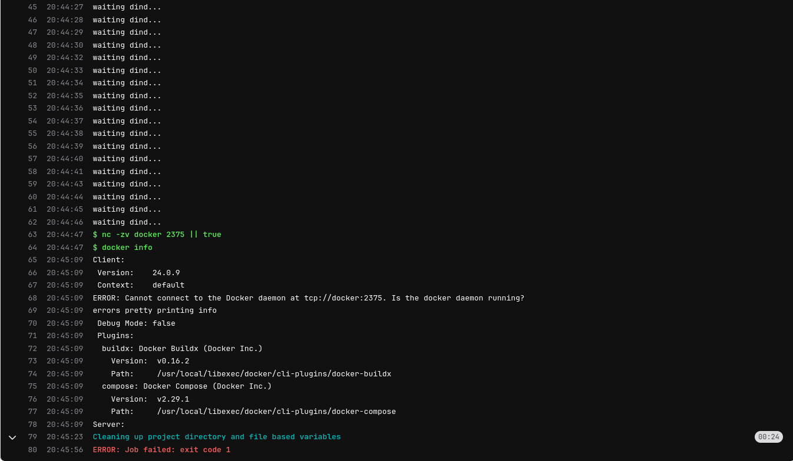
</p>

<p align="center">
  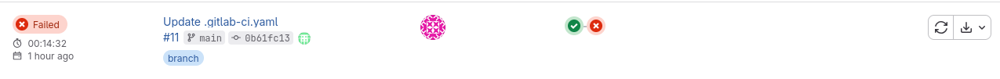
</p>

Если бы ошибки не было, можно было бы увидеть, что **Job** "build_and_push" собирает образ и пушит его в Nexus
Далее в Nexus можно было бы проверить наличие образа переходя в репозиторий docker-hosted и находя тег python-lab.

# Заключение #
В ходе лабораторной работы был настроен автоматизированный цикл CI/CD для Python-приложения. С помощью Docker Compose развернуты GitLab и Nexus, после чего они были интегрированы между собой. Созданное Python-приложение с тестами было помещено в GitLab-репозиторий, где настроен пайплайн: при пуше в основную ветку автоматически запускаются тесты, а при их успехе — собирается Docker-образ и отправляется в репозиторий Nexus. Мы не смомгли закончить лабораторную раюоту по причине аппаратных ограничений. В теории весь процесс работает автоматически, демонстрируя принципы непрерывной интеграции и доставки в современной разработке.
