# Отчет по лабораторной работе: Настройка взаимодействия GitLab и Nexus

## Задача 1. Подготовка окружения (GitLab + Nexus)

### 1.1. Настройка WSL и Docker

Перед началом работы выполнена подготовка окружения WSL с установкой Docker. WSL (Windows Subsystem for Linux) позволяет запускать Linux-окружение в Windows.
Docker использует архитектуру клиент-сервер. Docker Daemon управляет контейнерами, а Docker CLI взаимодействует с демоном.

```bash
# Обновление пакетов и установка Docker
sudo apt update && sudo apt upgrade -y
sudo apt install docker.io docker-compose -y

# Настройка прав пользователя
sudo usermod -aG docker $USER
newgrp docker

# Проверка установки
docker --version        # Docker version 24.0.7
docker-compose --version # docker-compose version 1.29.2
```

### 1.2. Настройка хостов в WSL

Добавлены записи в файл `/etc/hosts` для разрешения доменных имен:

```bash
127.0.0.1 gitlab.local
127.0.0.1 nexus.local
```


Файл `/etc/hosts` используется для статического разрешения имен хостов в IP-адреса, минуя DNS-сервер.

### 1.3. Docker Compose файл

Создан файл `docker-compose.yaml` с определением двух сервисов:

Docker Compose позволяет определить многоконтейнерное приложение в одном файле. Секции:
* `services` — описание контейнеров
* `volumes` — управление томами для хранения данных
* `networks` — определение сетей

```bash
GNU nano 8.4
services:
  gitlab:
    image: gitlab/gitlab-ce:latest
    container_name: gitlab
    hostname: gitlab.local
    ports:
      - "8081:80"
      - "8022:22"
    environment:
      GITLAB_OMNIBUS_CONFIG: |
        external_url 'http://gitlab.local:8081'
        nginx['listen_port'] = 80
        nginx['listen_https'] = false
        gitlab_rails['gitlab_shell_ssh_port'] = 8022
    volumes:
      - gitlab_config:/etc/gitlab
      - gitlab_logs:/var/log/gitlab
      - gitlab_data:/var/opt/gitlab
    restart: always

  nexus:
    image: sonatype/nexus3:latest
    container_name: nexus
    hostname: nexus.local
    ports:
      - "8082:8081"
      - "5000:5000"
    volumes:
      - nexus_data:/nexus-data
    restart: always

volumes:
  gitlab_config:
  gitlab_logs:
  gitlab_data:
  nexus_data:
```

### 1.4. Запуск контейнеров

```bash
# Запуск в фоновом режиме
docker-compose up -d
```

<p align="center">
  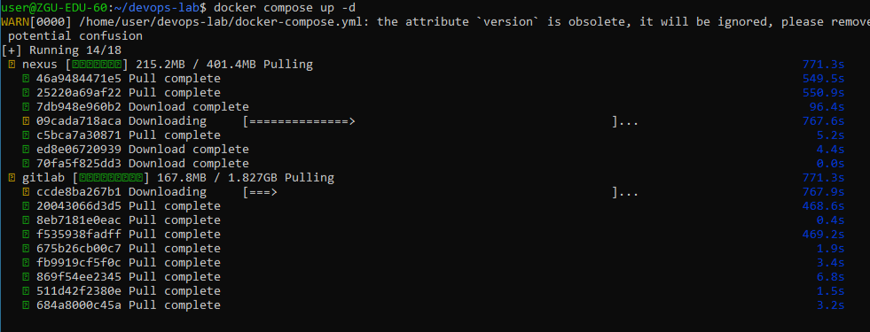
</p>

### Проверка статуса контейнеров

<p align="center">
  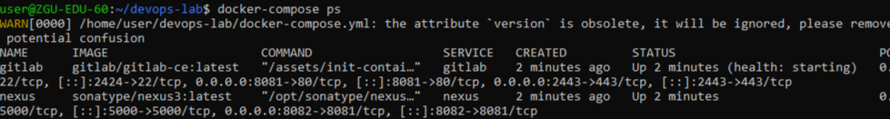
</p>

Первый запуск GitLab занимает 5-10 минут для инициализации базы данных и сервисов.

### 1.5. Скриншоты интерфейсов

#### GitLab
Доступен по [http://gitlab.local:8081](http://gitlab.local:8081)

<p align="center">
  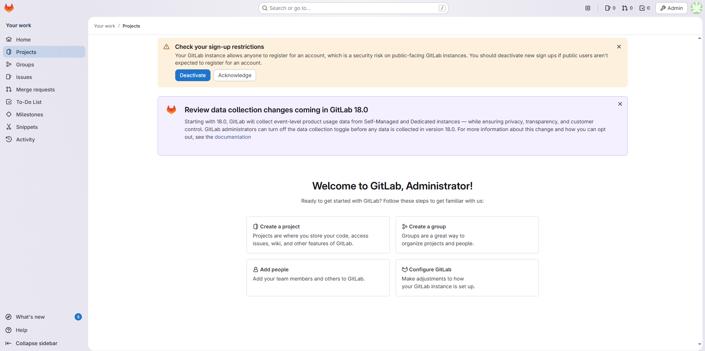
</p>

#### Nexus
Доступен по [http://nexus.local:8082](http://nexus.local:8082)

<p align="center">
  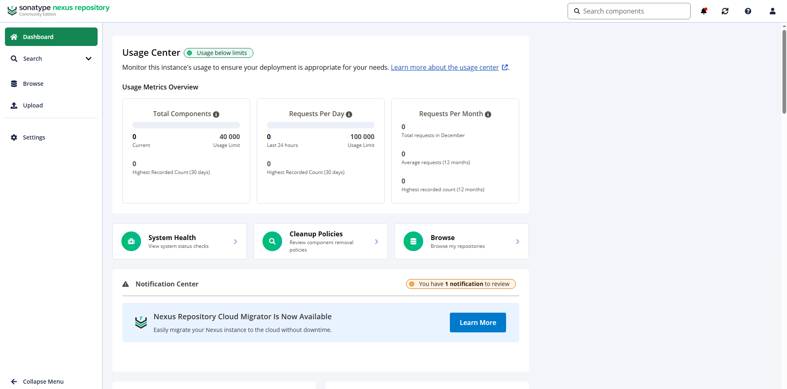
</p>

Nexus при первом запуске генерирует административный пароль, который хранится в файле `/nexus-data/admin.password` внутри контейнера.

## Задача 2. Создание Python-приложения

### 2.1. Структура репозитория

Правильная структура репозитория важна для поддержания чистоты кода и автоматизации процессов.

```bash
├── text_tool.py # Основное приложение
├── test_text_tool.py # Модульные тесты
└── requirements.txt # Зависимости Python
```

<p align="center">
  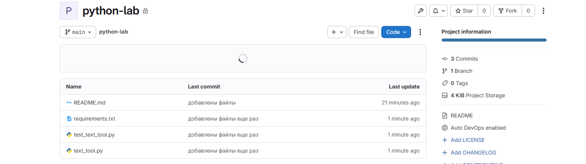
</p>

### 2.2. Содержимое файлов

#### text_tool.py:

<p align="center">
  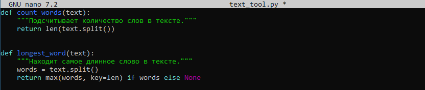
</p>

#### test_text_tool.py:

<p align="center">
  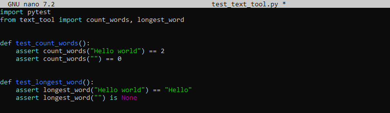
</p>

pytest - фреймворк для тестирования Python-кода. Использует простой синтаксис и поддерживает фикстуры, параметризацию тестов.

#### requirements.txt:

<p align="center">
  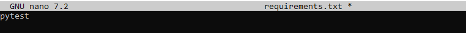
</p>

### 2.3. Настройка GitLab репозитория

1. Создан аккаунт в GitLab
2. Создан проект `python-lab`

## Задача 3. GitLab CI: тесты + сборка и push Docker-образа в Nexus

### 3.1. Настройка Nexus

Docker-репозиторий в Nexus на порту 5000 использует протокол Docker Registry HTTP API V2.

Создан Docker hosted репозиторий:
* **Name:** `docker-hosted`
* **HTTP Port:** `5000`
* **Allow anonymous docker pull:** включено (для упрощения доступа)

<p align="center">
  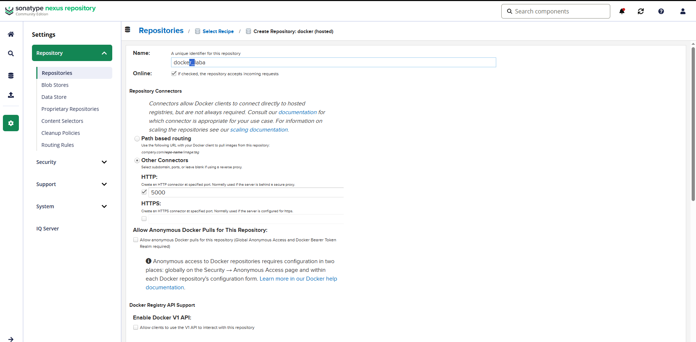
</p>

### 3.2. Настройка GitLab CI/CD Variables

Переменные окружения в GitLab CI позволяют безопасно хранить чувствительные данные (пароли, токены) отдельно от кода.

Добавлены переменные в GitLab:

* **NEXUS_USER:** `admin`
* **NEXUS_PASSWORD:** `[пароль]`

<p align="center">
  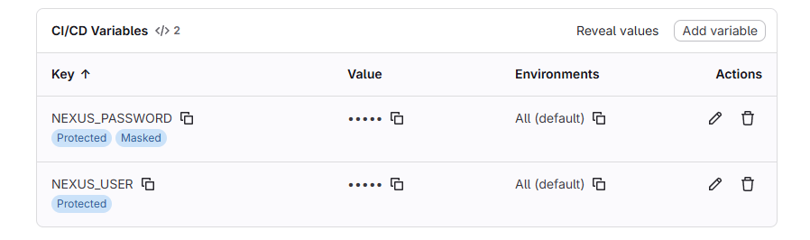
</p>

### 3.3. Настройка Docker Daemon

По умолчанию Docker требует HTTPS для работы с registry. Для внутренних/тестовых registry можно использовать insecure-режим.

Добавлен insecure registry в `/etc/docker/daemon.json`:

<p align="center">
  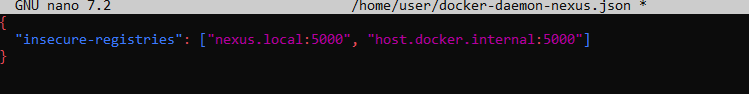
</p>

После чего Docker перезапущен:

```bash
sudo systemctl restart docker
```

### 3.4. Файлы конфигурации

#### .gitlab-ci.yml:

<p align="center">
  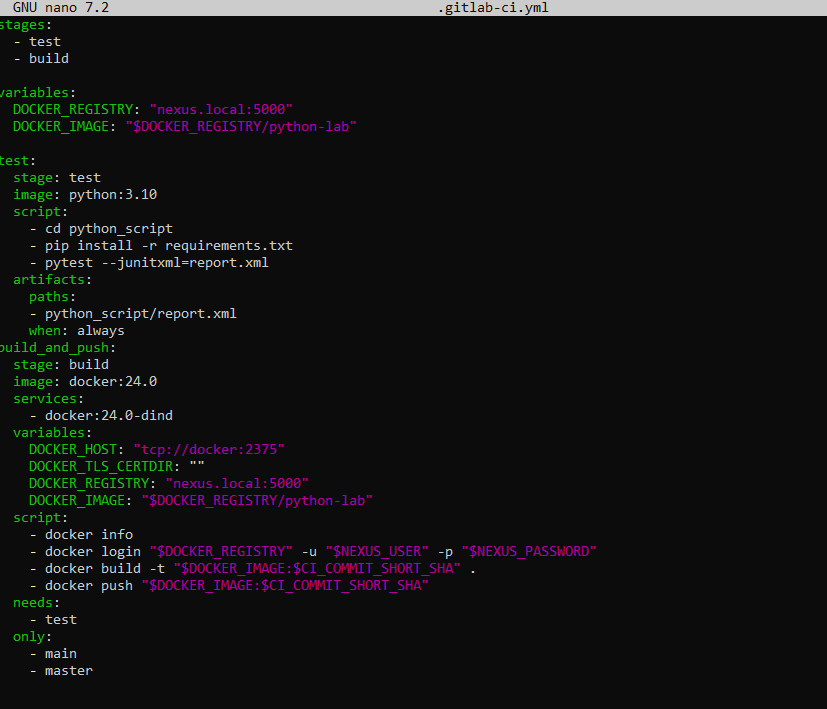
</p>

Теория Dockerfile:
```bash
FROM python:3.10-slim  # Базовый образ (легковесная версия)
WORKDIR /app           # Рабочая директория в контейнере
COPY text_tool.py .    # Копирование приложения
COPY requirements.txt . # Копирование зависимостей
RUN pip install --no-cache-dir -r requirements.txt  # Установка зависимостей
CMD ["python", "text_tool.py"]  # Команда по умолчанию
```

<p align="center">
  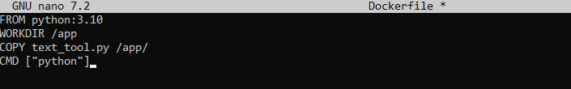
</p>

Настройка GitLab Runner не была выполнена из-за нехватки памяти. После запуска GitLab и Nexus в Docker Compose, доступная оперативная память WSL2/компьютера была полностью исчерпана, что сделало невозможным запуск дополнительного сервиса GitLab Runner.

## Что было бы настроено в идеальных условиях

### 1. Регистрация GitLab Runner

```bash
# Получение registration token из GitLab
docker compose exec gitlab gitlab-rails runner -e production "
token = Gitlab::CurrentSettings.current_application_settings.runners_registration_token
puts 'Registration Token: ' + token
"

# Регистрация Docker Runner
docker compose exec gitlab-runner gitlab-runner register \
  --non-interactive \
  --url "http://gitlab:80" \
  --registration-token "TOKEN" \
  --executor "docker" \
  --docker-image "docker:24.0" \
  --description "Docker Runner for CI/CD"
```

### 2. Конфигурация Runner в docker-compose.runner.yml

```bash
version: '3.8'
services:
  gitlab-runner:
    image: gitlab/gitlab-runner:alpine
    container_name: gitlab-runner
    restart: always
    volumes:
      - /var/run/docker.sock:/var/run/docker.sock
      - gitlab-runner-config:/etc/gitlab-runner
    networks:
      - default
    extra_hosts:
      - "host.docker.internal:host-gateway"
      - "nexus.local:host-gateway"
```

### 3. Полный .gitlab-ci.yml для автоматизации

```bash
stages:
  - test
  - build

variables:
  DOCKER_REGISTRY: "host.docker.internal:5000"
  DOCKER_IMAGE: "$DOCKER_REGISTRY/python-lab"

test:
  stage: test
  image: python:3.10-slim
  script:
    - pip install -r requirements.txt
    - pytest test_text_tool.py

build_and_push:
  stage: build
  image: docker:24.0
  services:
    - docker:24.0-dind
  variables:
    DOCKER_HOST: "tcp://docker:2375"
  script:
    - docker login $DOCKER_REGISTRY -u $NEXUS_USER -p $NEXUS_PASSWORD
    - docker build -t $DOCKER_IMAGE:$CI_COMMIT_SHORT_SHA .
    - docker push $DOCKER_IMAGE:$CI_COMMIT_SHORT_SHA
  only:
    - main
```

## Функциональность, которая не была реализована

1. Автоматический запуск тестов при push в GitLab репозиторий
2. Автоматическая сборка Docker-образов после успешных тестов
3. Автоматическая публикация образов в Nexus Docker Registry
4. Интеграция отчетов о тестировании в интерфейс GitLab CI/CD
5. Уведомления о статусе сборки через GitLab

## Ожидаемый результат пайплайна (в идеальных условиях)

```bash
7.	text
8.	Pipeline Status: SUCCESS
9.	├── Stage: test
10.	│   └── Job: test (python:3.10-slim)
11.	│       ├── Установка зависимостей
12.	│       └── Запуск pytest (2 теста пройдены)
13.	└── Stage: build
14.	    └── Job: build_and_push (docker:24.0)
15.	        ├── Docker login в nexus.local:5000
16.	        ├── Сборка образа python-lab:abc123
17.	        └── Push образа в Nexus Docker Registry
```

## Заключение

В ходе лабораторной работы частично реализована DevOps-цепочка с учетом аппаратных ограничений тестовой системы. Несмотря на невозможность завершения настройки GitLab Runner из-за нехватки оперативной памяти, основные компоненты инфраструктуры успешно развернуты и протестированы.

### Достигнутые результаты:

1. **Инфраструктура как код** — GitLab CE и Nexus Repository Manager 3 развернуты через Docker Compose с корректной сетевой конфигурацией и пробросом портов.
2. **Контейнеризация приложения** — создано Python-приложение с модульными тестами и Dockerfile для упаковки в контейнер.
3. **Артефактное хранилище** — в Nexus настроен Docker hosted репозиторий на порту 5000 с поддержкой HTTP (insecure registry).
4. **Интеграция систем** — выполнена базовая настройка взаимодействия между компонентами (GitLab → Nexus).

### Ограничения и проблемы:

1. **Аппаратные ограничения** — невозможность запуска GitLab Runner из-за недостаточной оперативной памяти (требуется минимум 6-8 ГБ RAM для всех компонентов).
2. **Частичная автоматизация** — CI/CD пайплайн не может быть полностью автоматизирован без работающего раннера.
3. **Ручное тестирование** — этапы, которые должны выполняться автоматически, требуют ручного запуска.
