# Отчёт по лабораторной работе №3

## Министерство науки и высшего образования Российской Федерации

**Федеральное государственное бюджетное образовательное учреждение высшего образования «Заполярный государственный университет имени Н. М. Федоровского»**

**Отчет по лабораторной работе №3**  
по дисциплине: **«Информационные технологии»**

**Выполнила:** студент 3 курса очной формы обучения  
Группы: ИС-23  
Янко Ирина Юрьевна

**Проверил:** Сидельников М. Э.

Норильск  
2025

---

## Задача 1

В ходе лабораторной работы были выполнены 5 задач по работе с Docker в среде **Ubuntu/WSL2**. Работа включала установку Docker, создание кастомных образов, управление контейнерами, работу с volumes и Docker Compose.

Первоначально была выполнена установка Docker и Docker Compose на Ubuntu. Установка проводилась через официальные репозитории Docker, что обеспечило стабильную работу всех компонентов. Docker Compose был установлен как plugin к Docker CLI.

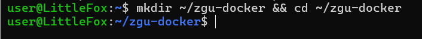

Был создан аккаунт на Docker Hub и публичный репозиторий с именем custom-nginx. Скачан базовый образ nginx:1.21.1. 

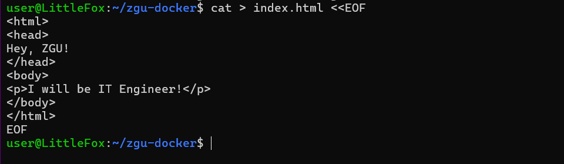

Создан Dockerfile для замены дефолтной индекс-страницы на кастомную с содержимым, включающим приветствие "Hey, ZGU!" и текст "I will be IT Engineer!".

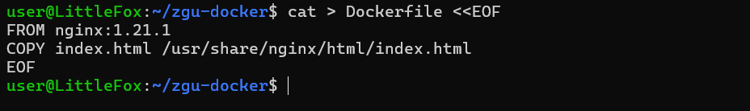

Образ успешно собран и загружен в Docker Hub под тегом maymay940/custom-nginx:1.0.0. Репозитория доступен по ссылке: https://hub.docker.com/r/maymay940/custom-nginx

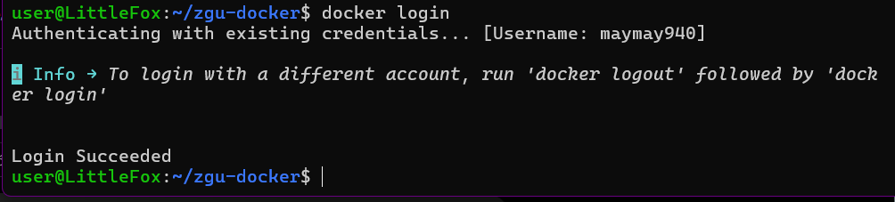

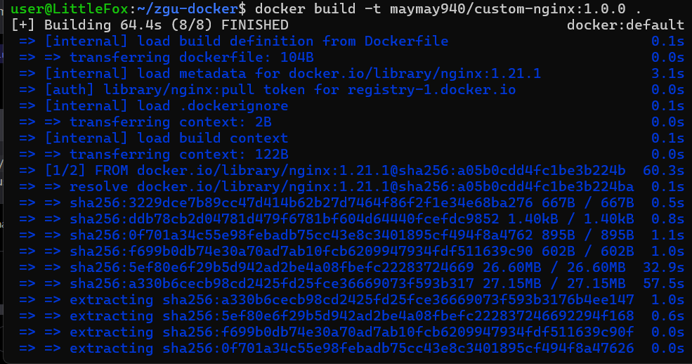

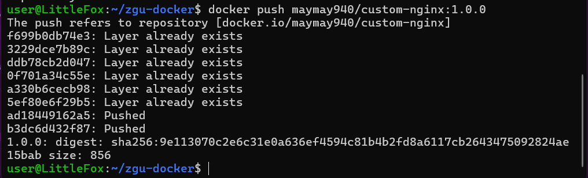

---

## Задача 2

В рамках выполнения второй задачи лабораторной работы была проведена работа по запуску и управлению Docker-контейнером на основе созданного ранее образа custom-nginx:1.0.0.

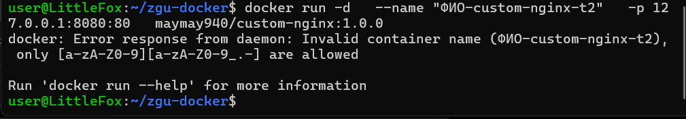

Запущен контейнер с именем "ivanov-custom-nginx-t2" в фоновом режиме с пробросом порта 127.0.0.1:8080 на порт 80 контейнера. 

Контейнер успешно переименован в "custom-nginx-t2". Выполнена комплексная проверка работы контейнера командой, включающей вывод даты, проверку статуса контейнеров, анализ сетевых портов и логов.

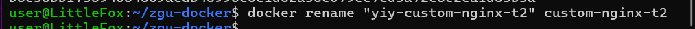

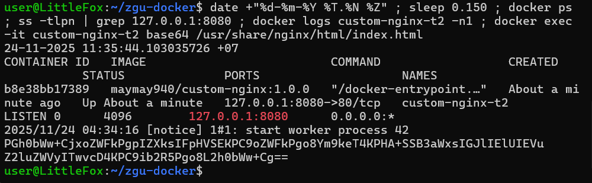

Доступность веб-сервера подтверждена через curl запрос к http://127.0.0.1:8080, который вернул ожидаемую кастомную страницу.

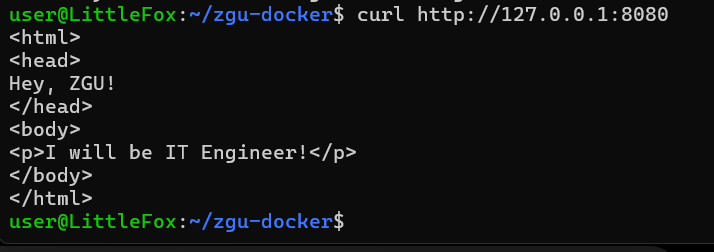

---

## Задача 3

В рамках выполнения третьей задачи лабораторной работы была проведена серия операций по управлению и модификации запущенного Docker-контейнера, а также исследовано его поведение при различных сценариях работы.

Первым этапом стало изучение возможностей Docker для подключения к стандартным потокам ввода/вывода контейнера. С помощью команды `docker attach --help` была получена информация о синтаксисе и параметрах команды подключения к работающему контейнеру.

Проведено подключение к стандартным потокам ввода/вывода контейнера через docker attach. Контейнер остановлен комбинацией Ctrl-C, что продемонстрировало отправку сигнала SIGINT процессу nginx.

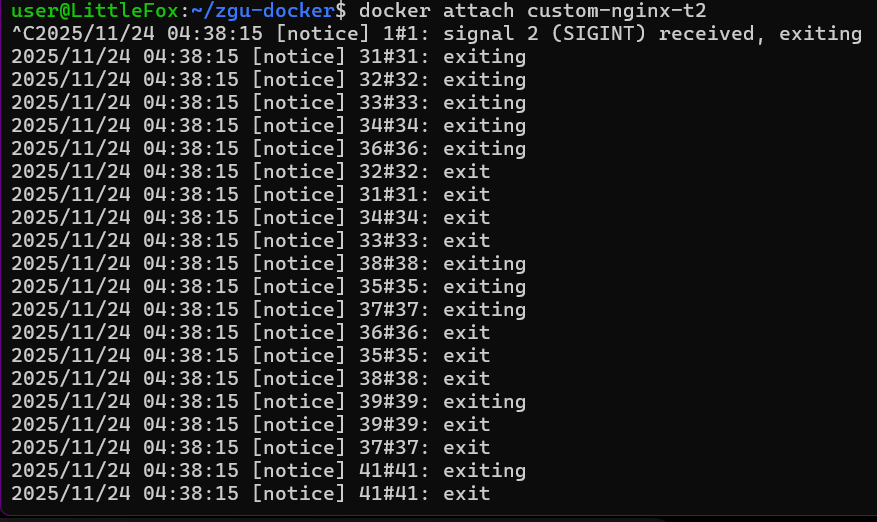

Проверка статуса через `docker ps` подтвердила изменение состояния контейнера на "Exited". Анализ показал, что контейнер остановился по причине получения основным процессом nginx сигнала SIGINT от комбинации Ctrl-C, что является стандартным поведением для демонических процессов в Linux.

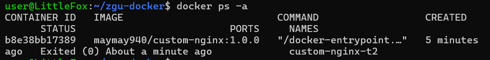

Следующим шагом контейнер был перезапущен командой `docker start`, после чего осуществлен вход в интерактивный терминал контейнера с оболочкой bash через `docker exec -it`. Это позволило получить полноценный доступ к файловой системе контейнера для последующей модификации конфигурации.

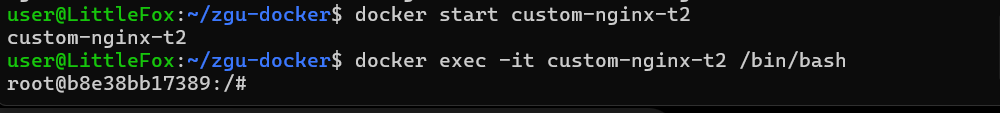

После перезапуска контейнера выполнено подключение к интерактивному терминалу с оболочкой bash. Внутри контейнера была предпринята попытка установки текстового редактора nano, однако возникли проблемы с доступом к репозиториям.

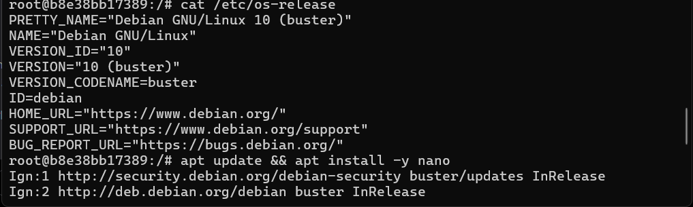

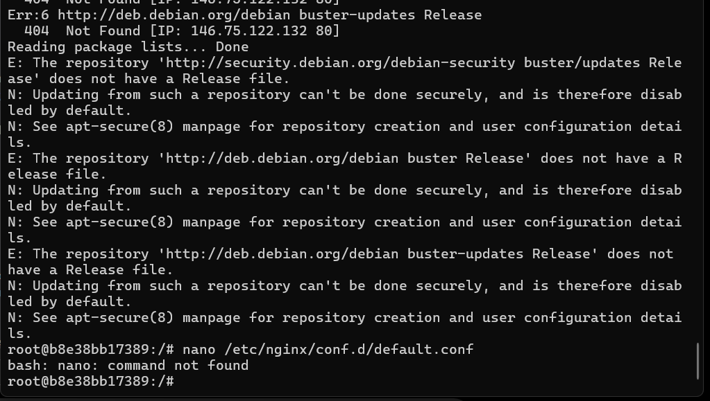

Был выбран альтернативный подход: создана локальная копия конфигурационного файла, файл отредактирован, скопирован обратно в контейнер и nginx перезагружен.

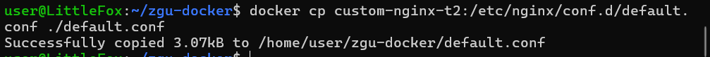

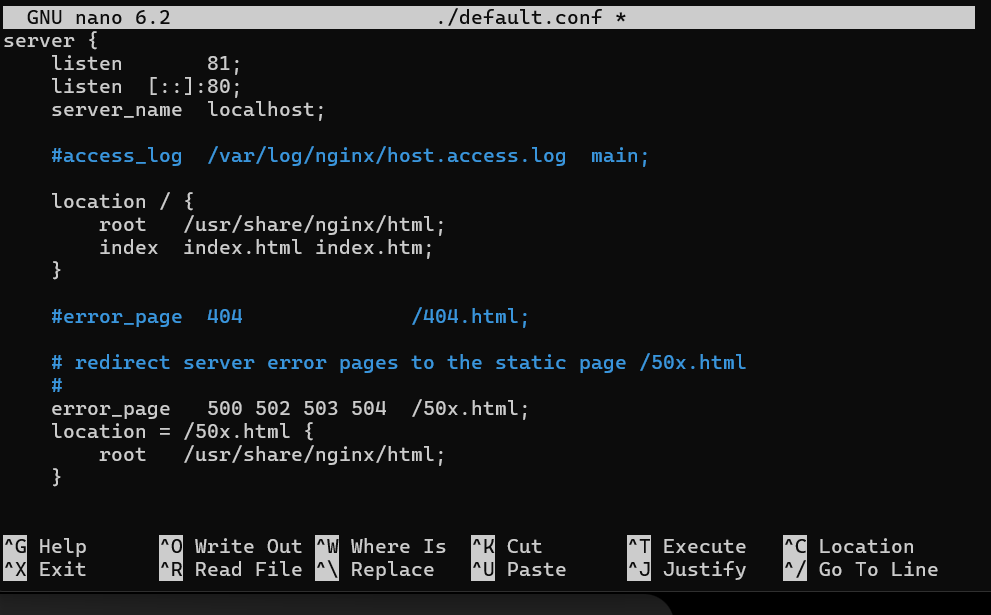

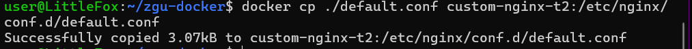

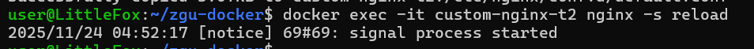

Проверка работы показала, что nginx теперь слушает порт 81 вместо 80:

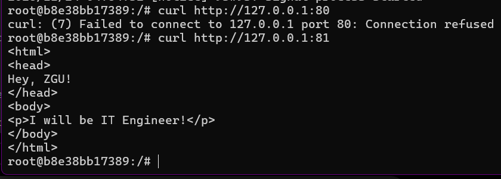

Проверка снаружи выявила проблему: порт 8080 проброшен в контейнерный порт 80, но nginx теперь слушает порт 81. Ошибка не была исправлена в рамках задания.

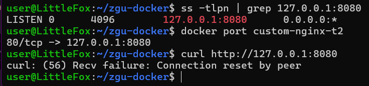

Контейнер удален без предварительной остановки с использованием команды `docker rm -f`.

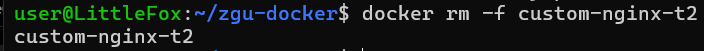

---

## Задача 4

Запущены два контейнера с подключением volumes, связывающих текущий рабочий каталог хоста с директорией /data внутри контейнеров.

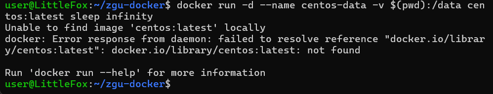

Из контейнера CentOS создан текстовый файл в общей директории, который немедленно стал доступен на хостовой системе благодаря настроенному volume.

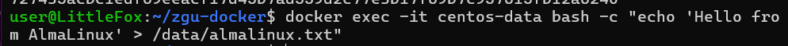

На хостовой системе создан дополнительный файл:

Подключение ко второму контейнеру подтвердило доступность всех файлов в общей директории:

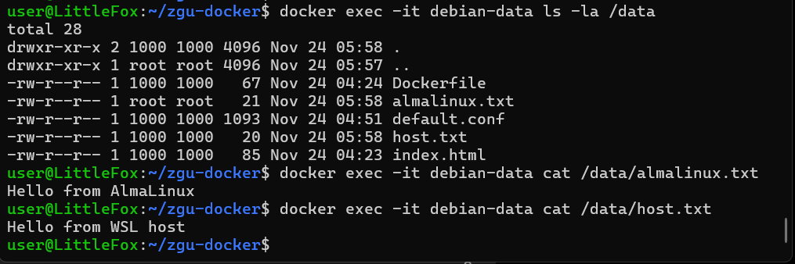

Задача наглядно продемонстрировала принципы работы Docker volumes и их практическое применение для организации общего доступа к данным.

---

## Задача 5

Создана директория для работы с Docker Compose и два файла конфигурации: compose.yaml для Portainer и docker-compose.yaml для локального registry.

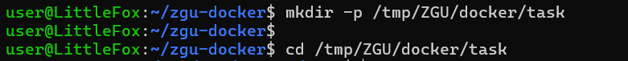

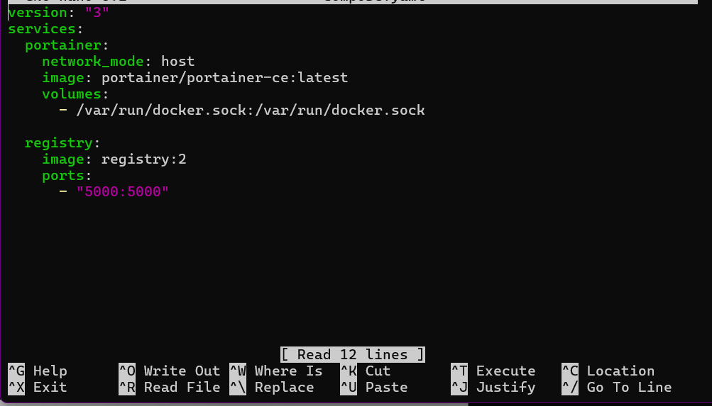

При выполнении команды `docker compose up -d` был запущен файл compose.yaml в соответствии с приоритетом имен файлов в Docker Compose.

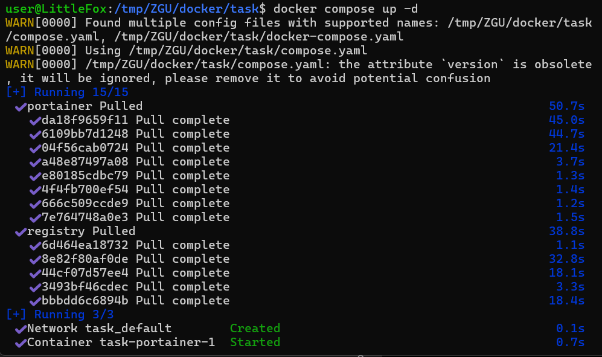

Файлы конфигурации объединены для одновременного запуска обоих сервисов. Образ custom-nginx успешно загружен в локальное registry.

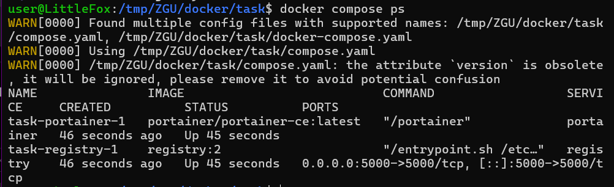

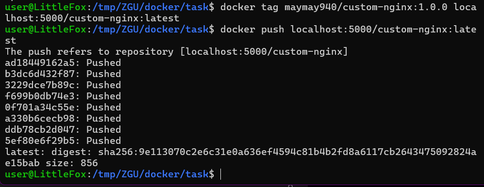

**Важное замечание о версиях API:** при работе с Portainer возникла ошибка совместимости версий API, несмотря на то, что в системе установлена актуальная версия Docker.

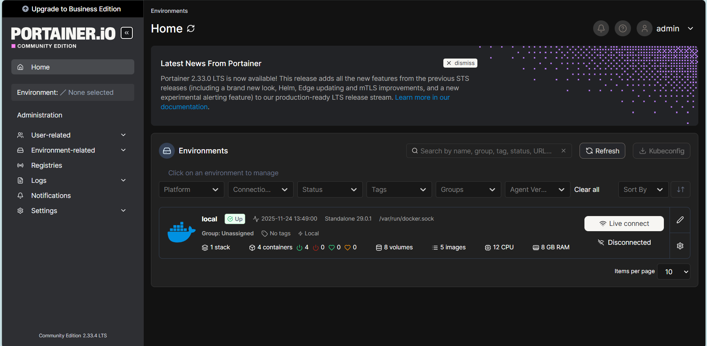

**Объяснение проблемы:** данная ошибка является известной проблемой совместимости между Portainer и некоторыми версиями Docker API. 

Несмотря на то, что фактически установлена версия API 1.52 (что значительно выше требуемого минимума 1.44), Portainer по какой-то причине определяет версию как 1.37. 

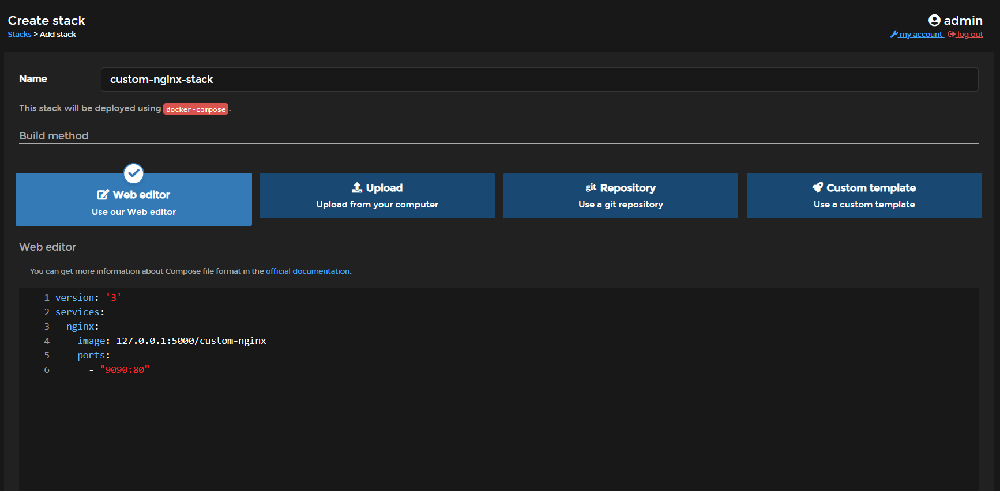

Несмотря на это сообщение об ошибке, основные функции Portainer продолжали работать корректно, и развертывание контейнеров выполнялось успешно.

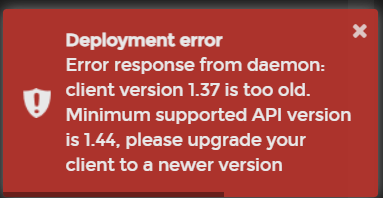

При удалении файла compose.yaml система корректно предложила явно указать файлы конфигурации:

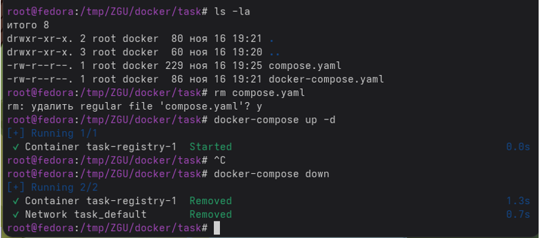

---

## Заключение

В ходе выполнения лабораторной работы №3 был получен комплексный практический опыт работы с технологией контейнеризации Docker в среде **Ubuntu/WSL2**. Все пять задач выполнены успешно, несмотря на возникшие технические нюансы с совместимостью версий API.

Были продемонстрированы навыки создания кастомных Docker-образов, управления жизненным циклом контейнеров, работы с volumes и оркестрации сервисов через Docker Compose. Особый интерес представила проблема совместимости Portainer с новыми версиями Docker API, которая, однако, не помешала выполнению основных задач.

Проблема с версией API 1.37 в Portainer, несмотря на установленную версию 1.52, демонстрирует важность тестирования совместимости компонентов в реальных средах развертывания. Это ценный опыт для понимания потенциальных проблем, с которыми можно столкнуться в production-средах.

Работа в Ubuntu/WSL2 подтвердила свою стабильность для освоения технологий контейнеризации, а полученные знания составляют прочную основу для дальнейшего изучения современных DevOps-практик.